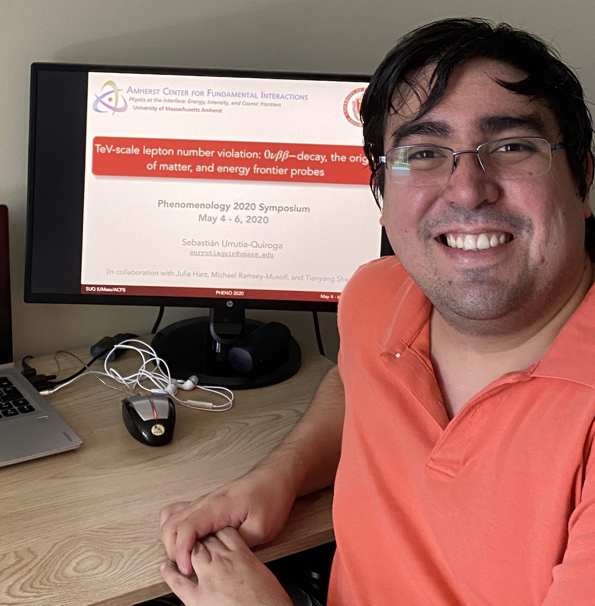

## Acerca de Mí

Soy Sebastián Urrutia Quiroga, un Chileno comprometido con la difusión del conocimiento científico, en particular de la física y la matemática.

Realicé mis estudios de pregrado en la [Escuela de Ingeniería](https://www.ing.uc.cl/) de la Pontificia Universidad Católica de Chile, donde me especialicé en ingeniería eléctrica. Posteriormente obtuve un M.Sc. en Física de Partículas en el [Instituto de Física](http://fisica.uc.cl/) de la misma universidad.

Actualmente soy estudiante de Ph.D. en Física en el [Departamento de Física](http://www.physics.umass.edu/) de la Universidad de Massachusetts Amherst, como parte del [_Amherst Center for Fundamental Interactions_](https://www.physics.umass.edu/acfi/).

Puedes encontrar mi CV _(Actualizado: Jul 2018)_ [**aquí**](CV.pdf).
